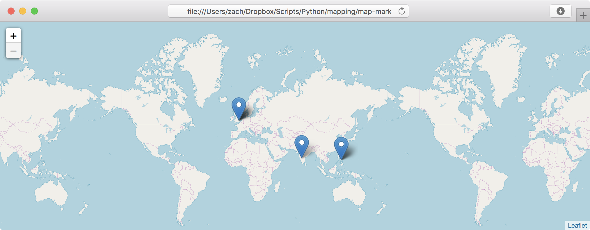
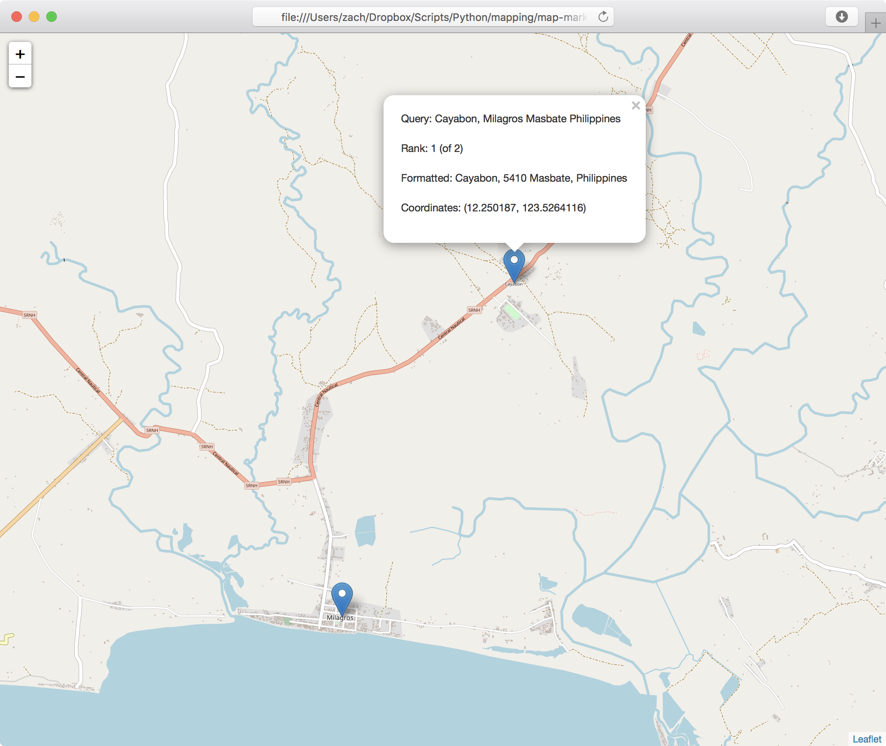

# map-marker
Create Folium maps with markers from natural language queries.

## Setup

1.  Create a `virtualenv`

		$ virtualenv --python=$(which python3) .

2.  Activate the `virtualenv`

	    $ source bin/activate

3.  Install dependencies

	    (map-marker) $ pip3 install -r requirements.txt

4.  Get an OpenCage API key from https://geocoder.opencagedata.com/users/sign_up

	    $ export OPENCAGE_USER_KEY=<key>

## Usage

    (map-marker) $ ./map_marker.py -h
    usage: map_marker.py [-h] [-z ZOOM] [-k KEY] input output
    
    Given a list of location queries, mark the locations on a Foium
    (https://github.com/python-visualization/folium) map via the OpenCage
    (https://geocoder.opencagedata.com/) geocoder service
    
    positional arguments:
      input                 a file with a list of queries (one query per line; use
                            "-" to read queries from stdin)
      output                a file where a folio.Map map will be written as HTML
      
    optional arguments:
      -h, --help            show this help message and exit
      -z ZOOM, --zoom ZOOM  starting zoom level (default: 0)
      -k KEY, --key KEY     your OpenCage API key (get a key here:
                            https://geocoder.opencagedata.com/users/sign_up)
                            (default: None)

To write a map to an HTML file that can be opened in your browser, you can run the script as follows:

    (map-marker) $ ./map_marker.py - -o map.html < queries.txt

The resulting `map.html` will have markers set for each result from OpenCage.  

The map is based on [`leaflet.js`](https://leafletjs.com), so you can dynamically scroll and zoom.  You can click the markers to see more info about the query and the OpenCage result for the query.

